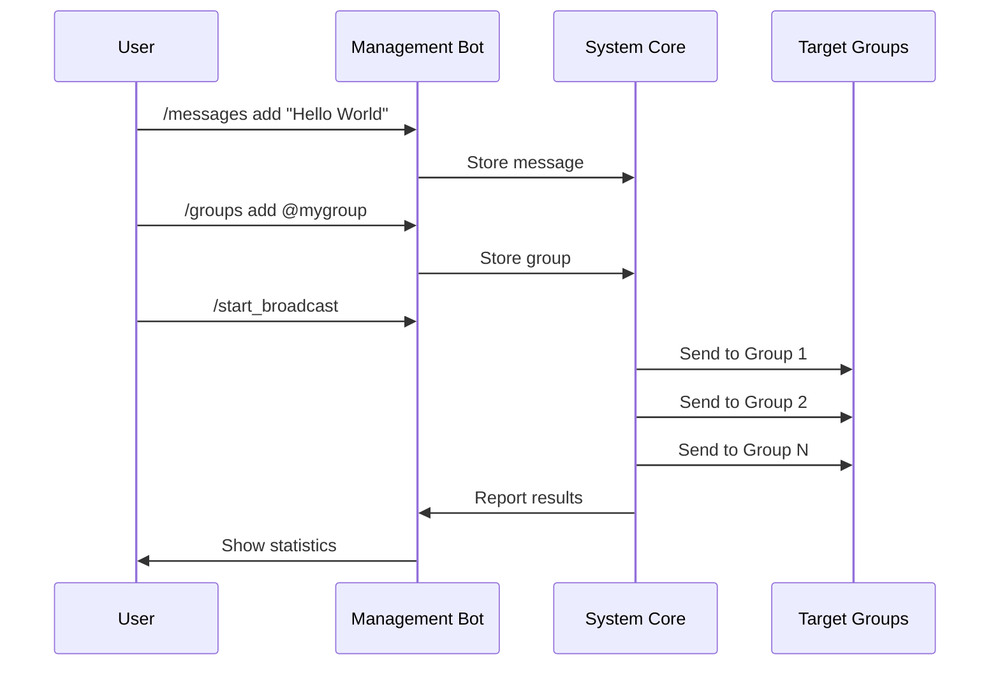

# Overview

Welcome to the Telegram Automation System! This guide will help you understand what the system does and how to get started.

## What is Telegram Automation System?

The Telegram Automation System is a powerful, professional-grade tool for automating mass messaging on Telegram. It's designed for users who need to send messages to multiple groups efficiently while respecting Telegram's limits and maintaining high reliability.

## Key Capabilities

### 🎯 **Mass Broadcasting**
- Send the same message to hundreds of groups
- Smart scheduling and timing management
- Support for text messages with rich formatting

### 🛡️ **Safety Features**
- **Smart Blacklist**: Automatically blacklist problematic groups
- **Flood Protection**: Respects Telegram rate limits
- **Error Recovery**: Handles temporary failures gracefully
- **Rate Limiting**: Configurable delays between messages

### 🎛️ **Management Interface**
- **Telegram Bot**: Control everything through Telegram
- **Message Management**: Create, edit, delete broadcast messages
- **Group Management**: Add, remove, organize target groups
- **Real-time Monitoring**: Track performance and status

### 📊 **Analytics & Monitoring**
- Message delivery statistics
- Group performance tracking
- Error analysis and reporting
- System health monitoring

## How It Works

## Architecture Overview

The system follows clean architecture principles:

- **Interface Layer**: Telegram Bot for user interaction
- **Service Layer**: Business logic and operations
- **Data Layer**: MongoDB for persistence
- **Core Layer**: Configuration and utilities

## Who Should Use This?

### ✅ **Perfect For:**
- Community managers with multiple groups
- Marketing teams doing Telegram campaigns
- Event organizers with announcements
- Content creators with multiple channels

### ⚠️ **Not Suitable For:**
- Spam or unsolicited messaging
- Violating Telegram Terms of Service
- High-frequency trading signals (use proper APIs)
- Personal message automation (use built-in features)

## Prerequisites

Before you start, make sure you have:

1. **Python 3.11+** installed
2. **MongoDB** running (local or cloud)
3. **Telegram Account** with API access
4. **Bot Token** from @BotFather
5. **Basic command line** knowledge

## What's Next?

Ready to get started? Here's your path:

1. **[Installation](installation.md)** - Set up the system
2. **[Configuration](configuration.md)** - Configure credentials
3. **[First Run](first-run.md)** - Test everything works
4. **[Bot Commands](../user-guide/bot-commands.md)** - Learn the interface

## Getting Help

- 📖 **Documentation**: You're reading it!
- 🐛 **Issues**: [GitHub Issues](https://github.com/dygje/Otogram/issues)
- 💬 **Discussions**: [GitHub Discussions](https://github.com/dygje/Otogram/discussions)
- 🔍 **Health Check**: Run `python scripts/health_check.py`

---

**Next**: [Installation Guide](installation.md) →