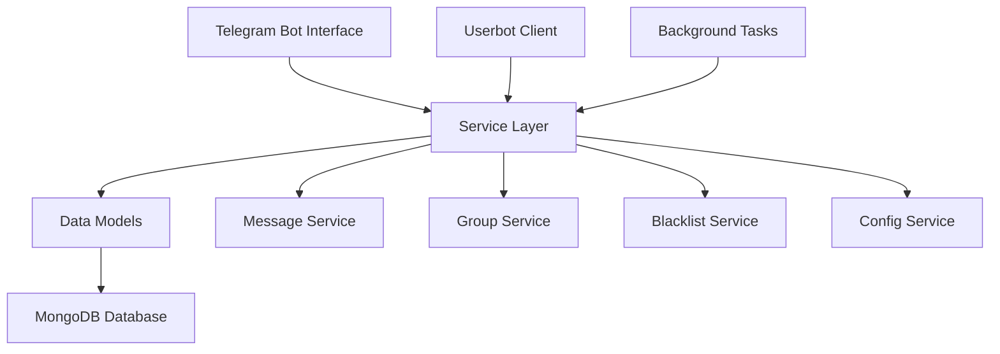

# Telegram Automation System

Welcome to the **Telegram Automation System** documentation! This is a professional, production-ready system for automating Telegram mass messaging with advanced management features.

## 🚀 Quick Start

Get up and running in minutes:

```bash
# 1. Install dependencies
pip install -r requirements.txt

# 2. Setup credentials (interactive)
python scripts/setup.py

# 3. Run the system
python main.py
```

## ✨ Key Features

### 🎯 **Core Automation**
- **Mass Broadcasting** - Send messages to multiple groups automatically
- **Smart Scheduling** - Intelligent delay and timing management
- **Real-time Monitoring** - Track performance and status live

### 🛡️ **Safety & Reliability**
- **Auto Blacklist** - Smart error handling and group management
- **Flood Protection** - Respects Telegram rate limits
- **Error Recovery** - Automatic retry with exponential backoff

### 🎛️ **Management Interface**
- **Telegram Bot** - Full control through Telegram interface
- **CRUD Operations** - Complete message and group management
- **Configuration** - Flexible system settings
- **Analytics** - Performance tracking and insights

## 🏗️ Architecture

Built with modern Python practices and clean architecture:



## 📋 Requirements

- **Python**: 3.11+ (recommended)
- **MongoDB**: 4.4+
- **Telegram API**: Credentials from [my.telegram.org](https://my.telegram.org)
- **Bot Token**: From [@BotFather](https://t.me/BotFather)

## 🎮 Usage Overview

1. **Setup**: Configure credentials and database
2. **Add Content**: Create broadcast messages
3. **Add Targets**: Import target groups
4. **Configure**: Set delays and safety limits
5. **Monitor**: Track performance and manage system

## 📚 Documentation Structure

| Section | Description |
|---------|-------------|
| [Getting Started](getting-started/overview.md) | Installation and initial setup |
| [User Guide](user-guide/bot-commands.md) | Daily operations and features |
| [API Reference](api/overview.md) | Code documentation |
| [Development](development/contributing.md) | Development and contributing |

## 🤝 Community

- **Issues**: [GitHub Issues](https://github.com/dygje/Otogram/issues)
- **Discussions**: [GitHub Discussions](https://github.com/dygje/Otogram/discussions)
- **Contributing**: See [Contributing Guide](development/contributing.md)

## 📄 License

This project is licensed under the MIT License - see the [LICENSE](about/license.md) file for details.

---

**Ready to get started?** Check out our [Installation Guide](getting-started/installation.md)!